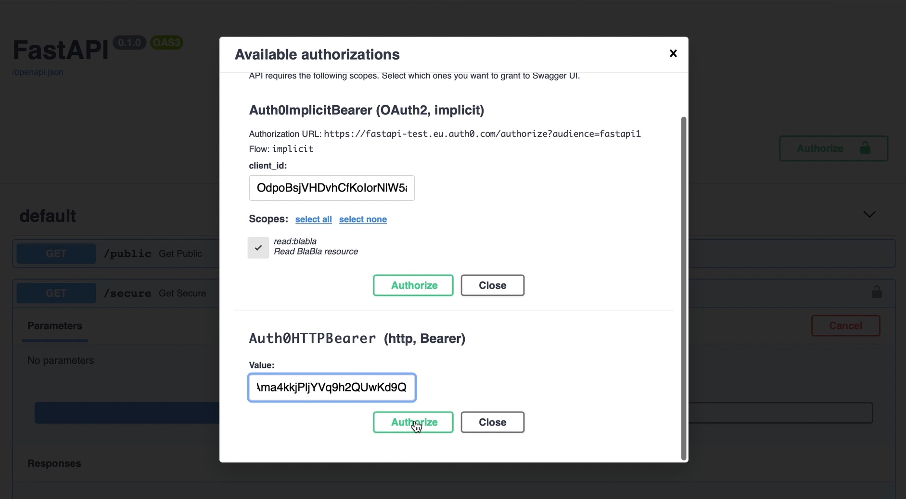

# Description
Integrate FastAPI with https://auth0.com in a simple and elegant way.
Get automatic Swagger UI support for the implicit scheme (along others), which means that signing in using social providers is only a few clicks away with no additional code.

# Installation
- `pip install fastapi-auth0`

# Requirements
Reading auth0 docs is recommended in order to understand the following concepts:
 - API's and audience
 - Applications
 - Grant types
 - Permissions and scopes

This library cannot do magic if the auth0 tenant is not configured correctly!

### Email field requirements
In order to get email for Auth0User, the API must have "openid profile email" permission and the rule "Add email to access token" must be added with the matching namespace, see [tests](tests/README.md).
The security is not affected in any way if we don't do this, but we need to if we want to know the user email's address. Otherwise, email field will always be `None`.

### Swagger UI login requirements
In order to utilize the interactive docs for the implicit flow, the callback url must be registered on the auth0 dashboard. For swagger this url is `{SWAGGER_DOCS_URL}/oauth2-redirect`, so if you are running FastAPI on localhost:8000, that becomes `http://localhost:8000/docs/oauth2-redirect`. Add it to "Allowed Callback URLs" for the application which you intend to login with (the client_id you input for Auth0ImplicitBearer authorization).

In order to logout and login with another user, it's necessary to manually call GET `https://{auth0_domain}/v2/logout`, becacause the Swagger UI logout button is not able to clear 3rd party session / cookies.

# Example usage
```Python
from fastapi import FastAPI, Depends, Security
from fastapi_auth0 import Auth0, Auth0User

auth = Auth0(domain='your-tenant.auth0.com', api_audience='your-api-identifier', scopes={'read:blabla': ''})
app = FastAPI()

@app.get("/public")
def get_public():
    return {"message": "Anonymous user"}

@app.get("/secure", dependencies=[Depends(auth.implicit_scheme)])
def get_secure(user: Auth0User = Security(auth.get_user, scopes=['read:blabla'])):
    return {"message": f"{user}"}
```



Example user responses:
```Python
id='Art2l2uCeCQk5zDVbZzNZmQkLJXLd9Uy@clients' permissions=['read:blabla'] email=None"              # user is M2M app
id='auth0|5fe72b8eb2ac50006f725451' permissions=['read:blabla'] email='some.user@outlook.com"      # user signed up using auth0 database
id='google-oauth2|115595596713285791346' permissions=['read:blabla'] email='other.user@gmail.com"  # user signed up using google
```

# Video tutorial
[https://youtu.be/cGRdFjgAy9s](https://youtu.be/cGRdFjgAy9s)
